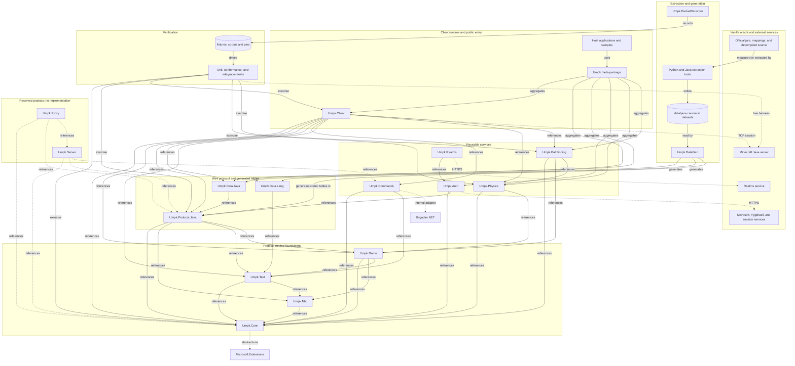

# UMPK

## Project overview

UMPK is a .NET 10 library for the Minecraft Java protocol. One codebase supports 49 protocol datasets from protocol 47 through 776. Vanilla source, official artifacts, and real packet captures are the acceptance oracle.

## Local skills

| Skill | Use for |
|---|---|
| `.skills/csharp-best-practices` | C# implementation and async review |
| `.skills/csharp-solid-principles` | Design, refactoring, and API boundaries |
| `.skills/asd-ste100` | Unambiguous procedures, errors, and agent instructions |
| `.skills/dotnet-performance-profiling-and-optimization` | Measured performance diagnosis |
| `.skills/dotnet-security-review` | Security and supply-chain review |
| `.skills/umpk-integration-testing` | Isolated live tests against vanilla servers |

Read a matching `SKILL.md` before using a skill. Resolve its relative references from its own directory.

## Commands

| Task | Command |
|---|---|
| Restore | `dotnet restore` |
| Build | `dotnet build UMPK.sln` |
| Test | `dotnet test UMPK.sln` |
| Format | `dotnet format --verify-no-changes` |
| Dataset | `dotnet run --project tools/Umpk.DataGen -- verify --data data/java` |
| Language data | `python3 tools/extraction/extract_lang.py --data data/java --check` |
| Generate | `dotnet run --project tools/Umpk.DataGen -- generate --data data/java --out src/Umpk.Data.Java --out-lang src/Umpk.Data.Lang --protocol-out src/Umpk.Protocol.Java` |
| Test counts | `python3 engineering/testcounts/check_test_counts.py /tmp/umpk-test.log --baseline engineering/testcounts/expected_counts.json` |

For the count gate, capture the unfiltered full test output in `/tmp/umpk-test.log`. Never store raw test logs in the repository.

## Architecture

Arrows labeled `references` or `aggregates` point from a consumer to its dependency. Other arrows show generated-data, runtime, or verification flow.

| Area | Responsibility |
|---|---|
| `src/Umpk.Core`, `Nbt`, `Text`, `Game` | Protocol-neutral foundations and models |
| `src/Umpk.Data.*` | Generated protocol descriptors and language tables |
| `src/Umpk.Protocol.Java` | Framing, codecs, registration, login, configuration, and play |
| `src/Umpk.Client` | Session lifecycle, state, interaction, and navigation |
| `src/Umpk.Physics`, `Pathfinding` | Vanilla movement simulation and route execution |
| `src/Umpk.Auth`, `Realms`, `Commands` | Authentication, Realms, and command trees |
| `data/java` | Canonical per-protocol dataset |
| `fixtures` | Recorded frames and generated conformance pins |
| `tests`, `samples`, `tools` | Validation, examples, generation, and extraction |

`Umpk.Server` and `Umpk.Proxy` are reserved empty projects. Do not describe them as implemented.

## Development procedure

1. Inspect the checkout and preserve unrelated changes.
2. State the behavior and affected protocols before editing.
3. Verify wire, physics, and era boundaries against the matching vanilla artifact.
4. Add a focused test and observe the expected failure.
5. Implement the smallest change through the existing ownership and capability abstractions.
6. Run the focused test after each production-file change.
7. Run adjacent protocol and lifecycle regressions.
8. Run the full build, test-count, format, dataset, language, and generated-output gates.
9. Record exact commands, versions, artifact hashes, observed results, and unexecuted checks.

Missing prerequisites, skipped legs, truncated output, and aborted runs are not passes. Separate executed facts, observations, inferences, and harness failures.

## Adding a protocol version

Read `docs/contributing/adding-a-version.md` before editing. Then use this sequence:

1. Determine whether the release is only a new name for an existing protocol. If so, update `data/java/versions.json`, regenerate, and do not move codec timelines or pins.
2. For a new protocol, provision its official jar, mappings, and source under the ignored `MinecraftOfficial/` tree. Record hashes and source evidence for each changed wire boundary.
3. Generate vanilla reports and extract `data/java/<protocol>/`. Review `features.json`; never copy a neighboring feature value without source evidence.
4. Run DataGen `verify`, `diff` against the previous protocol, and the layout oracle when a matching decompiled tree exists. The oracle is a review aid, not a conformance result.
5. Regenerate `Umpk.Data.Java`, `Umpk.Data.Lang`, and the generated tables in `Umpk.Protocol.Java`. Review generated diffs; never edit `.g.cs` files directly.
6. Add source-backed `From(...)` steps only where a packet wire form changes. Let the prior timeline step resolve forward where the form is unchanged.
7. Add the protocol to `JavaProtocols`, `LiveMatrix`, literal era tables, dataset mappings, and any applicable public API files. Run `python3 engineering/refactor/add-protocol-rows.py --check <protocol>`.
8. Add real-frame byte round trips, neighboring-band rejection witnesses, wire-shape coverage, and the required codec, registration, timeline, and witness pins. Regenerate pins only through their documented environment-gated test commands.
9. Run focused boundary tests, the adjacent protocols, one live vanilla leg, and the complete build, test-count, format, dataset, language, generated-output, and conformance gates.

Treat a stable packet identifier as insufficient evidence: packet IDs, layouts, registries, feature axes, and lifecycle rules can change independently.

## Protocol and runtime invariants

- Put era behavior in dataset features or existing profile abstractions. Do not scatter protocol number checks through engine code.
- Prove codecs with real bytes, asserted decoded values, and byte-identical round trips.
- Install finalized registries before releasing play decoding.
- Process required login and configuration obligations in frame order and await them.
- Keep spawn, readiness, world lifetime, and cancellation as distinct states.
- Distinguish no-session failures, caller cancellation, and live-session teardown.
- Assign one owner to each timer, transport, resource, and state transition.
- Keep the session tick as the only locomotion clock. Report applied input and collision state.
- Make recovery atomic and bounded. Preserve strict handling for malformed or truncated frames.
- Keep resource-pack acceptance, download, cache, and hash verification independently opt-in.
- Dispose owned transports and verify peer-observed EOF, not only local completion.

## Coding standards

- Follow `.editorconfig`: UTF-8, LF, final newline, four-space C# indentation, and file-scoped namespaces.
- Never hard-wrap prose in source comments, documentation, or Markdown files.
- Before writing a pull request body or commit message, read and apply the `humanizer` skill. Keep both concise.
- Write each paragraph, list item, and source comment on one physical line. Let the editor or renderer wrap it for the reader.
- Keep newlines only where syntax or structure requires them, such as headings, blank lines, lists, tables, block quotes, and code blocks. Long prose lines are expected and preferred.
- Do not apply an 80, 100, or 120-column limit to prose. Optimize text files for wide screens.
- Nullable annotations and warnings-as-errors are part of the contract.
- When you change `<Version>` in `Directory.Build.props`, update `CHANGELOG.md` in the same change.
- Add public API additions to the affected `PublicAPI.Unshipped.txt`.
- Library diagnostics use `ILogger`; banned APIs are listed in `engineering/BannedSymbols.txt`.
- Preserve Native AOT compatibility. Prefer generated tables and explicit registration over reflection.
- Update test-count baselines only for deliberate, explained test changes.

`dotnet format` owns C# whitespace and import order. It requires a space after a collection spread such as `.. value`, expands dense initializers, and sorts each complete `using` block. Run it instead of adjusting individual files until the diagnostics disappear.

`Brigadier.NET 2.0.15-beta` is an internal dependency of `Umpk.Commands`. Keep Brigadier types out of public UMPK APIs. The wrapper and its API-surface test preserve consumer compatibility if the dependency changes.

## Boundaries

### Always

- Review generated and fixture diffs line by line.
- Use isolated ports, directories, processes, and bounded waits for live tests.
- Verify the exact commit and binaries used by consumer or live tests.
- Keep credentials, session material, raw logs, dumps, and downloaded game artifacts outside Git.

### Ask first

- Change a dataset value or add a feature axis.
- Remove or rename public API, add a dependency, or change a DI lifetime.
- Re-record corpus traffic or rewrite a pin fixture.
- Use a public server or authenticated account.
- Push commits, create tags, publish packages, or create a release.

### Never

- Hand-edit `.g.cs` files or generated pins.
- Weaken tests or expected counts to hide a failure.
- Add server-specific hacks, fake input, duplicate timers, or broad exception suppression.
- Commit Mojang jars, libraries, credentials, auth caches, raw logs, or heap dumps.
- Stop or modify a server, port, session, or process owned by another run.
