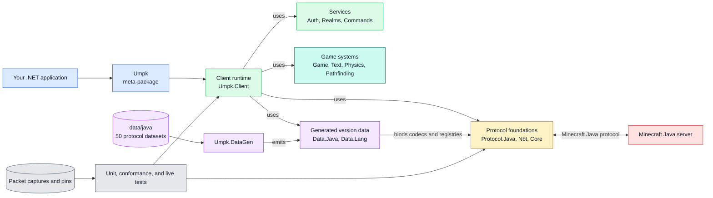

# UMPK

UMPK, the Universal Minecraft Protocol Kit, is a .NET 10 toolkit for programs that need to speak Minecraft Java Edition. Use it to build bots, automated players, protocol tools, and other clients without running the official game. The library handles the wire protocol, sessions, game state, authentication, chat, inventory, and movement.

UMPK supports 49 Java protocol revisions across 72 named Minecraft releases. Protocol data comes from Mojang artifacts, vanilla source, and recorded server traffic. Version differences live in data and capability tables instead of separate client forks.

> [!WARNING]
> UMPK is still in heavy development. APIs, behavior, and documentation are subject to change. Pin the version or commit that your application uses.

## Features

| Feature | Summary |
| --- | --- |
| Java protocol | Handshake, status, login, configuration, play packets, compression, and encryption. |
| Client runtime | Connection lifecycle, supervised reconnects, transfers, cancellation, events, and snapshots. |
| World state | Chunks, blocks, entities, players, registries, dimensions, and local player state. |
| Inventory | Player inventory, containers, click prediction, reconciliation, merchants, and dialogs. |
| Chat and text | Chat components, translations, commands, signed chat, and command trees. |
| Movement | Version-aware physics, collisions, player input, A* pathfinding, and route execution. |
| Authentication | Microsoft device-code and browser login, Yggdrasil, offline identity, and token storage. |
| Resource packs | Opt-in acceptance, bounded downloads, SHA-1 checks, and caching. UMPK does not render packs. |
| Realms | World listing and join support for Minecraft Realms. |
| Status ping | Modern server status and the legacy pre-1.7 server-list response. |
| Generated data | Per-protocol blocks, items, entities, registries, menus, packet tables, and collision shapes. |
| Native AOT | Shipping projects declare AOT compatibility and include a native smoke test. |

## Supported Minecraft versions

UMPK supports Java Edition play protocols from 1.8 through 26.3.

| Family | Supported releases |
| --- | --- |
| 1.8 | 1.8, 1.8.1, 1.8.2, 1.8.3, 1.8.4, 1.8.5, 1.8.6, 1.8.7, 1.8.8, 1.8.9 |
| 1.9 | 1.9, 1.9.1, 1.9.2, 1.9.3, 1.9.4 |
| 1.10 | 1.10, 1.10.1, 1.10.2 |
| 1.11 | 1.11, 1.11.1, 1.11.2 |
| 1.12 | 1.12, 1.12.1, 1.12.2 |
| 1.13 | 1.13, 1.13.1, 1.13.2 |
| 1.14 | 1.14, 1.14.1, 1.14.2, 1.14.3, 1.14.4 |
| 1.15 | 1.15, 1.15.1, 1.15.2 |
| 1.16 | 1.16, 1.16.1, 1.16.2, 1.16.3, 1.16.4, 1.16.5 |
| 1.17 | 1.17, 1.17.1 |
| 1.18 | 1.18, 1.18.1, 1.18.2 |
| 1.19 | 1.19, 1.19.1, 1.19.2, 1.19.3, 1.19.4 |
| 1.20 | 1.20, 1.20.1, 1.20.2, 1.20.3, 1.20.4, 1.20.5, 1.20.6 |
| 1.21 | 1.21, 1.21.1, 1.21.2, 1.21.3, 1.21.4, 1.21.5, 1.21.6, 1.21.7, 1.21.8, 1.21.9, 1.21.10, 1.21.11 |
| 26.x | 26.1, 26.2, 26.3 |

Minecraft versions earlier than 1.8 are not supported. The legacy status ping can read older server-list responses, but it does not provide play-protocol support. See the [protocol table](docs/reference/supported-versions.md) for protocol numbers and dataset mappings.

## Quick start

Install the [.NET 10 SDK](https://dotnet.microsoft.com/download/dotnet/10.0), then add the complete client stack:

```bash
dotnet add package Umpk --version 0.9.0-beta.2
```

You can instead install focused packages such as `Umpk.Protocol.Java`, `Umpk.Nbt`, or `Umpk.Text`. To build the source:

```bash
git clone https://github.com/MCCTeam/UMPK.git
cd UMPK
dotnet build UMPK.sln
dotnet test UMPK.sln
```

Query a Java server without an account:

```bash
dotnet run --project samples/StatusPing -- mc.example.com
```

Connect an offline-mode bot to a server you control:

```bash
dotnet run --project samples/MinimalBot -- localhost:25565 Steve
```

To work against an unreleased checkout, reference the projects from source:

```xml
<ItemGroup>
  <ProjectReference Include="../UMPK/src/Umpk/Umpk.csproj" />
</ItemGroup>
```

Read [installation](docs/getting-started/installation.md) and the [minimal bot guide](docs/getting-started/minimal-bot.md) for the full setup and client lifecycle.

## Architecture



The [package overview](docs/packages/overview.md) explains each library and its dependencies.

## Roadmap

| Item | Plan |
| --- | --- |
| Integration Tests on real Minecraft servers | Run automated integration tests against real vanilla Minecraft servers. |
| Java 1.7.2 | Add protocol 4 data, codecs, fixtures, and live tests. |
| Java 1.7.4 | Add its version mapping and compare its protocol behavior with vanilla. |
| Java 1.7.10 | Add protocol 5 data, codecs, fixtures, and live tests. |
| Bedrock protocol | Build a separate RakNet transport and Bedrock protocol stack. |
| Server | Implement the reserved `Umpk.Server` project. |
| Proxy | Implement the reserved `Umpk.Proxy` project after the server-side protocol exists. |

Roadmap entries describe intent, not shipped features.

## Documentation

- [Documentation home](docs/index.md)
- [Offline examples](docs/getting-started/offline-samples.md)
- [Authentication](docs/guides/authentication.md)
- [Chat and signing](docs/guides/chat-and-signing.md)
- [Inventory and resource packs](docs/guides/inventory-and-resource-packs.md)
- [Movement and pathfinding](docs/guides/movement-and-pathfinding.md)
- [Known limitations](docs/reference/limitations.md)

## Contributing and AI use

Read [CONTRIBUTING.md](CONTRIBUTING.md) before opening a change. UMPK treats vanilla behavior and real packet bytes as evidence, so protocol changes need more than a passing unit test.

AI tools are welcome for drafts, repetitive work, and test ideas. Review every changed line. Never send credentials, session data, private packet captures, or downloaded Minecraft artifacts to an external service. Read [Using AI](docs/contributing/using-ai.md) for the project rules.

## License

UMPK is available under the [MIT License](LICENSE).
