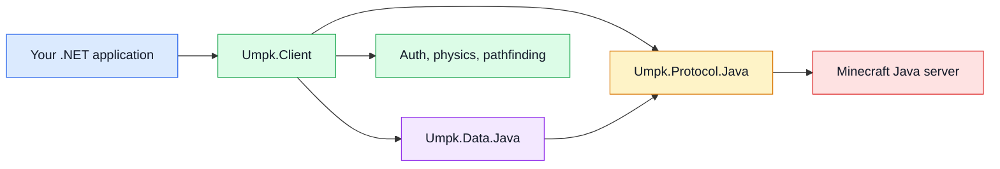

UMPK is a .NET library for talking to Minecraft Java Edition servers. One codebase covers 50 protocol datasets, from 1.8 (protocol 47) through 26.3 (protocol 777). There are no per-version forks, no reflection at runtime, and every package is marked AOT compatible.

It is designed for headless clients, protocol tools, and automation applications.

> [!WARNING]
> UMPK is in active development. Public APIs, supported behavior, and documentation can change before 1.0. Pin a release or commit when you build on it.

## How the pieces fit

Your application creates one client for one Java protocol version. The client uses generated protocol tables to encode packets, maintain game state, and select version-specific behavior. Optional packages add authentication, physics, pathfinding, commands, text, and Realms support.

## The idea in one paragraph

Supporting twenty years of protocol changes usually means either a fork per version or a thicket of version checks. UMPK takes a third route: the differences between versions live in data, not in code. A per-protocol dataset under `data/java/` records which codecs bind to which packet ids, which features exist, and how behavior changed, and a generator turns that into compiled tables. Engine code asks the dataset what this version does instead of comparing protocol numbers.

The other half of the approach is evidence. Wire formats and physics constants are checked against Mojang's own releases and real packet captures. Source comments record the resulting behavior and compatibility boundaries, while change reviews retain the detailed research evidence.

## Where to go next

- [Installation](getting-started/installation.md) if you want to add UMPK to a project.
- [Offline samples](getting-started/offline-samples.md) for five small programs that need no server: chat, NBT, physics, versions, and offline identity.
- [Your first status ping](getting-started/status-ping.md) for a working program in about thirty lines.
- [A minimal bot](getting-started/minimal-bot.md) to connect, listen to chat, and say something.
- [A connected bot](getting-started/connected-bot.md) to ping, log in, join, and trade chat lines.
- [Inventory and resource packs](guides/inventory-and-resource-packs.md) to inspect containers, click safely, and choose a resource-pack policy.
- [Packages](packages/overview.md) if you would rather see the module map first.
- [Supported versions](reference/supported-versions.md) for the full protocol table.
- [Using AI](contributing/using-ai.md) for rules that keep generated changes reviewable and safe.
- [Releasing NuGet packages](contributing/releasing.md) for validation, publishing, and recovery.

## What is not here

Being direct about the gaps, since the package names imply more than exists:

- `Umpk.Server` and `Umpk.Proxy` are reserved, empty projects. There is no server-side connection layer and no proxy support.
- Bedrock Edition is not supported and not started. It shares no meaningful transport or protocol with Java Edition, so it would be a new package rather than an extension of this one.
- No package has a frozen public API yet. Every declaration still sits in `PublicAPI.Unshipped.txt`, so names can change between versions.

[Limitations](reference/limitations.md) covers the smaller known gaps.
